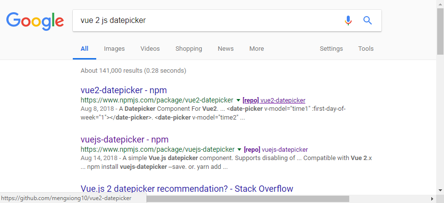

# NPM Repo Links Chrome Extension

A Google Chrome browser extension which adds links to the repositories of NPM
packages on Google search results.

When viewing a Google search results page which contains links to packages
on npmjs.com, links will be added to the search results to their source control
repositories if they exist.

